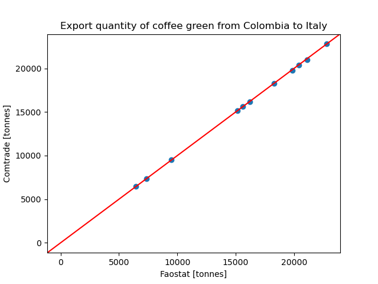

<!--
The following comments will not appear in the paper.

- Journal of Open Source Software (JOSS)- Paper submission guidelines
  https://joss.readthedocs.io/en/latest/submitting.html

- Compile this paper to a pdf document with the script specified in .gitlab-ci.yml. JOSS
  uses the openjournals/inara docker image and compiles the document with the following
  script:

      inara -p -o pdf paper/paper.md

End comments.
-->

# Summary

The aim of the `biotrade` package is to enable regular updates of agriculture, fisheries
and forest products trade data from the international data sources of FAOSTAT
[-@faostat2023] and UN Comtrade [-@comtrade2023]. The
software provides methods to join data across sources as well as to aggregate and rank
the most important products and the most important countries, as well as geographical
areas (e.g. continents). It also provides tools to
assess the quality of the data, by comparing for example mirror flows or unit prices of
trade. The package allows to store and update as well the collection of time series of the World Bank Group [-@worldbank2023].


# Statement of need

The production of bio-commodities, agricultural and forest products, and international
trade of these products is receiving increasingly attention because of their potential
impacts in terms of land use change, and embodied green-house-gas emissions
[@pendrill2022disentangling]. Disciplines such as environmental economics or Life Cycle
Analysis are concerned with research questions such as: (1) what is the ecological
footprint of bio-commodity production and international trade? or (2) how do
agricultural market prices react to natural disasters? To analyse these questions on a
global scale, researchers use models based on time series of commodities production and
trade with data covering many countries and many years in a panel format. Every month,
or a few times per year, countries update their data in a centralised way through
international organisations such as the United Nations (UN) Food and Agriculture
Organisation (FAO) or the UN Comtrade. This data is made available in the form of files
on a public website from which they can be downloaded. In order to regularly monitor
these datasets, dedicated open-source tools can help download data into statistical
programming software such as Julia, Matlab, Python, R or SAS. The availability of these
tools make it possible for practitioners and scientists to quickly access the data, to
re-run an analysis, update the data with the latest release quickly, generate plots and
model outputs when new data become available in a time series. Thus, they facilitate
reproducible research and the activities of stakeholders. Such download tools to access
and download data exist already in the R and python packaging ecosystems. The R package
`FAOSTAT` [@kao2022faostat] can download and prepare FAOSTAT data. The R package WDI
[@arelbundock2022] downloads data from the World Bank including the World Development
Indicators. The python package `eurostat` [@cazzaniga2022eurostat] can download Eurostat
data, so does the R package `eurostat` [@lahti2017retrieval].

However, there is no package that can download from all these sources under a common
naming scheme. Also, all these packages only load data frames and leave it up to the
user to save their data for later. Here we present the `biotrade` package, an
open-source package that allows for downloading production, land use, and trade dataset
from FAOSTAT, and trade data from the UN Comtrade.

Unlike the tools already available, the `biotrade` package creates a local copy inside a
database that can be easily accessible for further calculations. Moreover, the
`biotrade` package harmonises variable names across data sources. Finally, it provides a
series of methods to assess the quality of the data, and for the calculations of
statistics and temporal and geographical aggregation of the data, ranking the countries
with more production or trades of a specific products, among others.

In the following sections we describe: 1) the structure of the package and associated
database 2) methods for calculations, aggregation and comparison of production and trade
data.


# Data update and package structure

Thanks to the SQL Alchemy [@bayer2012] abstraction layer `biotrade` can use different
database engines. The data is cached in a local database which can be either an SQLite
database (the default) or a PostGreSQL database (user defined through an environment
variable). Database tables are structured with unique constraints to ensure that there
is no duplication when data is updated.

The package is structured by data sources. Each source has a series of methods to
download and aggregate data. Some functions that perform comparison and data aggregation
are common to all data sources.

The following python code updates crop production data by downloading it from the
FAOSTAT API:

```
from biotrade.faostat import faostat
faostat.pump.update(["crop_production"])
```

The following code loads sawnwood other (HS code 440799) and soya beans (HS code 120190)
trade reported by Italy (reporter code 381) in 2020 from the Comtrade API:

```
from biotrade.comtrade import comtrade
sawnwood99_it = comtrade.pump.download_df(cc = "440799", r="381", ps="2020")
soya_beans_it = comtrade.pump.download_df(cc = "120190", r="381", ps="2020")
```

Variable names are harmonized across data sources. The benefit is that python or R code
become more readable when moving from one data source to another, as well as that
comparison between data sources are straightforward. The table \autoref{tab:colnames}
shows the naming convention and some of the variable names used across different
sources.

\label{tab:colnames}

| biotrade       | comtrade         | faostat production   | faostat trade        | world_bank     |
| -------------- | ---------------- | -------------------- | -------------------- | -------------- |
| year           | year             | year                 | year                 | year           |
| reporter       | reporter         | area                 | reporter_countries   | country_name   |
| partner        | partner          |                      | partner_countries    |                |
| product_code   | commodity_code   | item_code            | item_code            |                |


One issue when working with UN Comtrade and FAOSTAT data, is that country codes are
different between the two sources. The package contains a mapping table between country
codes in the 2 coding system, as well as ISO codes and continent and sub-continent
aggregates. In addition the UN Comtrade product classification is vastly larger than the
FAOSTAT product classification. The `biotrade` package also contains a mapping table
between FAOSTAT product codes and the Harmonized System classification used in Comtrade.
The country and product mapping tables make it possible to convert UN comtrade data into
the FAOSTAT format, so that it can be analysed in the same way. Aggregation functions
are also based on these country and product mapping tables.


# Methods for calculations, aggregation and comparison of production and trade data

Example use of the `nlargest` function to display the 3 largest wheat producers
globally:

```
from biotrade.faostat import faostat
from biotrade.common.aggregate import nlargest
wheat = faostat.db.select("crop_production", product="wheat")
wheat_largest =  nlargest(
    # Remove aggregates (continents) and keep only recent years
    wheat.query("reporter_code < 1000 and year > year.max() - 10"),
    value_vars="value",
    agg_groups=["reporter", "product"],
    slice_groups=["element", "unit"],
    n=5
)
wheat_largest

#    product         element                   reporter    unit        value
# 0    wheat  area_harvested                      India      ha   30205021.0
# 1    wheat  area_harvested         Russian Federation      ha   25698803.1
# 2    wheat  area_harvested                      China      ha   24189501.9
# 3    wheat  area_harvested            China, mainland      ha   24187166.0
# 4    wheat  area_harvested   United States of America      ha   17344652.9
# 5    wheat      production                      China  tonnes  128605992.0
# 6    wheat      production            China, mainland  tonnes  128600610.0
# 7    wheat      production                      India  tonnes   95949997.0
# 8    wheat      production         Russian Federation  tonnes   65938100.0
# 9    wheat      production   United States of America  tonnes   54897588.9
# 10   wheat           yield                    Ireland   hg/ha      91991.6
# 11   wheat           yield                New Zealand   hg/ha      89421.0
# 12   wheat           yield                    Belgium   hg/ha      87399.3
# 13   wheat           yield                Netherlands   hg/ha      87030.2
# 14   wheat           yield United Kingdom of Great...   hg/ha      79164.2
```

The `biotrade` package can also be used from the R statistical software, thanks to an
interface with python called reticulate [@ushey2023]. Example loading FAOSTAT crop
production data from within R and ranking countries with the `nlargest` function. Rows
are aggregated by `agg_groups`, sorted by the first of the `value_vars` and slicing
takes the first 5 rows in each slice group:

```
# This is the only R code example in this document
library(reticulate)
library(dplyr)
py_run_string("from biotrade.faostat import faostat")
py_run_string("from biotrade.common.aggregate import nlargest")
wheat <- py$faostat$db$select("crop_production", product="wheat")
wheat_largest <- wheat %>%
    # Remove aggregates (continents) and keep only recent years
    filter(reporter_code < 1000 & year > max(year) - 10) %>%
    py$nlargest(value_vars="value",
                agg_groups=c("reporter", "product"),
                slice_groups=c("element", "unit"),
                n=5)
str(wheat_largest)
# 'data.frame':   15 obs. of  5 variables:
#  $ product : chr  "wheat" "wheat" "wheat" "wheat" ...
#  $ unit    : chr  "ha" "ha" "ha" "ha" ...
#  $ element : chr  "area_harvested" "area_harvested" "area_harvested" ...
#  $ reporter: chr  "India" "Russian Federation" "China" "China, mainland" ...
#  $ value   : num  30205021 25698803 24189502 24187166 17344653 ...
#  - attr(*, "pandas.index")=RangeIndex(start=0, stop=15, step=1)
```

<!--
- TODO: Illustrate the unit price of trade based on Comtrade data
- TODO: Illustrate FAOSTAT Bilateral trade Compared to Comtrade bilateral trade
-->


The following code maps Comtrade to Faostat product codes with the function
`merge_faostat_comtrade` to compare trades of the two data sources.

```
from biotrade.common.compare import merge_faostat_comtrade
import matplotlib.pyplot as plt

df = merge_faostat_comtrade(
    faostat_table="crop_trade", comtrade_table="yearly", faostat_code=[656]
)
df = df[
    (df.reporter == "Colombia")
    & (df.partner == "Italy")
    & (df.element == "export_quantity")
    & (df.year > 2010)
]
df_pivot = df.pivot(index=["reporter", "year", "partner"], columns="source", values="value")
fig, ax = plt.subplots()
ax.axline([ax.get_xlim()[0], ax.get_ylim()[0]], [ax.get_xlim()[1], ax.get_ylim()[1]], color='r')
ax.scatter(df_pivot.faostat / 1000, df_pivot.comtrade / 1000)
plt.xlabel("Faostat [tonnes]")
plt.ylabel("Comtrade [tonnes]")
plt.title("Export quantity of coffee green from Colombia to Italy")
plt.show()
```


<!--
- TODO: Illustrate other aggregation and comparison functions
-->

Aggregate bilateral trade data to 27 European Member States and rest of the World as
reporter or partners through `agg_trade_eu_row` function.

```
from biotrade.faostat import faostat
palm_oil = faostat.db.select(
    table="crop_trade",
    product="palm_oil",
    reporter="Indonesia",
    element="export_quantity",
    period_start=2018,
)

palm_oil_agg = agg_trade_eu_row(palm_oil, grouping_side="partner")
print(palm_oil_agg)

   reporter_code   reporter partner  product_code   product  element_code          element  period  year    unit        value
0            101  Indonesia      eu           257  palm_oil          5910  export_quantity    2018  2018  tonnes   3707358.77
1            101  Indonesia      eu           257  palm_oil          5910  export_quantity    2019  2019  tonnes   3402457.71
2            101  Indonesia      eu           257  palm_oil          5910  export_quantity    2020  2020  tonnes   3326492.32
3            101  Indonesia      eu           257  palm_oil          5910  export_quantity    2021  2021  tonnes   2815188.47
4            101  Indonesia     row           257  palm_oil          5910  export_quantity    2018  2018  tonnes  24186229.87
5            101  Indonesia     row           257  palm_oil          5910  export_quantity    2019  2019  tonnes  24086164.86
6            101  Indonesia     row           257  palm_oil          5910  export_quantity    2020  2020  tonnes  22610175.02
7            101  Indonesia     row           257  palm_oil          5910  export_quantity    2021  2021  tonnes  22716583.50
```


Compare flows through `put_mirror_beside` function, which adds a column to the dataframe
with the corresponding mirror flows.

```
from biotrade.common.compare import merge_faostat_comtrade
from biotrade.faostat.mirror import put_mirror_beside

df = merge_faostat_comtrade(
    faostat_table="crop_trade", comtrade_table="yearly", faostat_code=[236]
)
df = df[
    (df.reporter.isin(["Brazil", "Argentina"]))
    & (df.partner.isin(["Brazil", "Argentina"]))
    & (df.year > 2020)
    & (df.element.isin(["import_quantity", "export_quantity"]))
]
df = put_mirror_beside(df)
print(df)
      source  reporter_code   reporter  partner_code    partner  product_code     product  element_code          element  year unit        value flag  value_mirror flag_mirror
0    faostat             21     Brazil             9  Argentina           236  soya_beans          5610  import_quantity  2021   kg    4840840.0    A     2499580.0           A
1    faostat             21     Brazil             9  Argentina           236  soya_beans          5910  export_quantity  2021   kg  218176100.0    A   218176890.0           A
2    faostat              9  Argentina            21     Brazil           236  soya_beans          5610  import_quantity  2021   kg  218176890.0    A   218176100.0           A
3    faostat              9  Argentina            21     Brazil           236  soya_beans          5910  export_quantity  2021   kg    2499580.0    A     4840840.0           A
4   comtrade              9  Argentina             9  Argentina           236  soya_beans          5610  import_quantity  2021   kg     689204.0                NaN         NaN
5   comtrade              9  Argentina            21     Brazil           236  soya_beans          5910  export_quantity  2021   kg    2499580.0          4840836.0
6   comtrade              9  Argentina            21     Brazil           236  soya_beans          5610  import_quantity  2021   kg  218176890.0        218176103.0
7   comtrade             21     Brazil             9  Argentina           236  soya_beans          5910  export_quantity  2021   kg  218176103.0        218176890.0
8   comtrade             21     Brazil             9  Argentina           236  soya_beans          5610  import_quantity  2021   kg    4840836.0          2499580.0
9   comtrade             21     Brazil             9  Argentina           236  soya_beans          5910  export_quantity  2022   kg  289472763.0                NaN         NaN
10  comtrade             21     Brazil             9  Argentina           236  soya_beans          5610  import_quantity  2022   kg     675419.0                NaN         NaN
```


# Conclusion

The `biotrade` package is a preparation tool that updates agriculture and forestry
production and trade data based on global sources. It enforces a naming convention on
variables to make sure similar variable names are used across data sources. As source
Application Programming Interfaces (API) tend to change their access mechanisms every
few years; the goal of the package maintainers is to abstract away those changes and
provide a unified method to update data, that should continue to work with future
updates. The package provides convenient methods to store intermediate results and to
select data. We encourage users to install the `biotrade` package, to test it and to
send feedback through the [issues
page](https://gitlab.com/bioeconomy/forobs/biotrade/-/issues). We believe that the
package will be of interest of scientist, stakeholders, or practitioners that are
interested in monitoring production, land use and trade data.


# References


